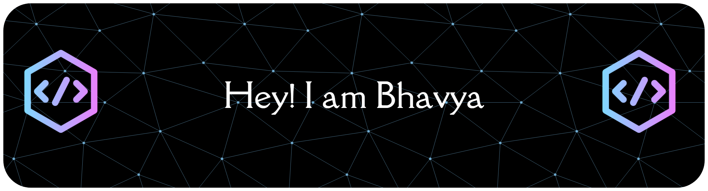

## 🚀 About Me

Passionate AI Engineer building intelligent systems since 2023. I create sophisticated applications spanning Machine Learning, Deep Learning, and Generative AI—blending cutting-edge technology with thoughtful design to solve real-world challenges. Always learning, experimenting, and pushing AI boundaries.

* 🌍  I'm based in India
* ✉️  You can contact me at [bhavyshah.work@gmail.com](mailto:bhavyshah.work@gmail.com)
* 🧠  I'm learning Agentic AI
* 🤝  I'm open to collaborating on AI Projects
* ⚡  Short code, long legacy 

## 🛠️ Tech Stack
### Programming Languages

### AI/ML

### Web Frameworks & Libraries

### Databases

## 📊 My GitHub Stats

  

  <picture>
    <source media="(prefers-color-scheme: dark)" srcset="./dist/github-snake-dark.svg">
    <source media="(prefers-color-scheme: light)" srcset="./dist/github-snake.svg">
    
  </picture>

## 🤝 Let's Connect

 <a href="https://discord.com/users/bhavya3199" target="_blank" rel="noreferrer"> <picture> <source media="(prefers-color-scheme: dark)" srcset="https://raw.githubusercontent.com/danielcranney/readme-generator/main/public/icons/socials/discord-dark.svg" /> <source media="(prefers-color-scheme: light)" srcset="https://raw.githubusercontent.com/danielcranney/readme-generator/main/public/icons/socials/discord.svg" />  </picture> </a> <a href="https://www.github.com/shahbhavya7" target="_blank" rel="noreferrer"> <picture> <source media="(prefers-color-scheme: dark)" srcset="https://raw.githubusercontent.com/danielcranney/readme-generator/main/public/icons/socials/github-dark.svg" /> <source media="(prefers-color-scheme: light)" srcset="https://raw.githubusercontent.com/danielcranney/readme-generator/main/public/icons/socials/github.svg" />  </picture> </a> <a href="https://www.linkedin.com/in/bhavya-shah-a36a86282/" target="_blank" rel="noreferrer"> <picture> <source media="(prefers-color-scheme: dark)" srcset="https://raw.githubusercontent.com/danielcranney/readme-generator/main/public/icons/socials/linkedin-dark.svg" /> <source media="(prefers-color-scheme: light)" srcset="https://raw.githubusercontent.com/danielcranney/readme-generator/main/public/icons/socials/linkedin.svg" />  </picture> </a> <a href="http://www.medium.com/@phantomthunder77" target="_blank" rel="noreferrer"> <picture> <source media="(prefers-color-scheme: dark)" srcset="https://raw.githubusercontent.com/danielcranney/readme-generator/main/public/icons/socials/medium-dark.svg" /> <source media="(prefers-color-scheme: light)" srcset="https://raw.githubusercontent.com/danielcranney/readme-generator/main/public/icons/socials/medium.svg" />  </picture> </a> <a href="https://www.x.com/BhavyaShah66754" target="_blank" rel="noreferrer"> <picture> <source media="(prefers-color-scheme: dark)" srcset="https://raw.githubusercontent.com/danielcranney/readme-generator/main/public/icons/socials/twitter-dark.svg" /> <source media="(prefers-color-scheme: light)" srcset="https://raw.githubusercontent.com/danielcranney/readme-generator/main/public/icons/socials/twitter.svg" />  </picture> </a>

